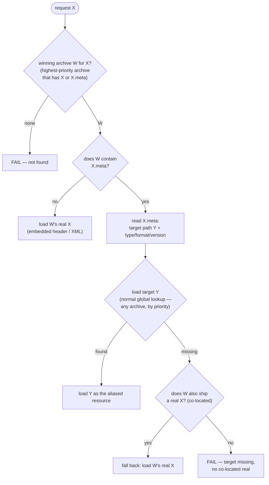
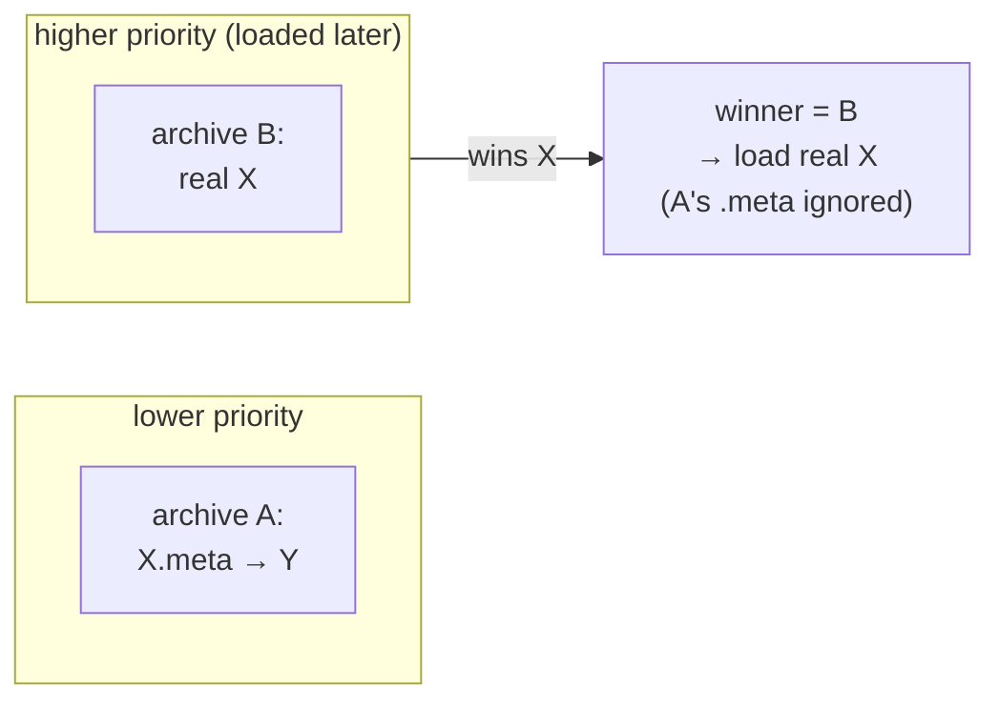

# `.meta` alias loading flow

How libultraship resolves a resource request when a `.meta` alias is involved, across one or more
layered archives. This is the **intended model** (the target of the override-identity rework); it
matches the rules in [README.md](README.md#resolution-model-what-a-layered-meta-does). It's kept as
a standalone Mermaid diagram so it can be ported into the LUS doxygen docs later.

## Terms

- **X** — the resource path being requested (e.g. `textures/nintendo_rogo_static/gShipLogoDL`).
- **X.meta** — a JSON sidecar that describes/aliases X: a target `path` plus `type`/`format`/`version`.
- **winning archive (W)** — the highest-priority loaded archive that supplies X *or* X.meta. `X`
  and `X.meta` are **one** override identity, so a single archive wins the slot (last loaded =
  highest priority).

## Resolution flow

## Which path each test case takes

| outcome (leaf) | meaning | test cases |
|---|---|---|
| `load W's real X` | winner has no `.meta`; plain load | case5, **L1**, L1b |
| `load Y (target)` | alias resolved to its target | case1, case3, **L2**, L5 (mod loaded), **L6** |
| `fall back: real X` | target missing, co-located real used | case2, L5 (vanilla boot) |
| `FAIL` | nothing to load | case4, **L3**, and "none" |

(Bold = the layered / archive-priority cases.)

## Priority / override identity

`X` and `X.meta` share one override slot. Indexing an archive that contains `X.meta` also claims
the base name `X`, so whichever archive is highest priority owns the identity — and only *that*
archive's `.meta` (if any) is consulted:

This is why a higher-priority real asset beats a lower-priority `.meta` (test **L1**): the winner
is chosen first, and a lower archive's `.meta` never gets a look in.

Note the asymmetry the flow relies on:

- The alias **target Y** is a *different* path, resolved by a normal global lookup — it's found in
  whatever archive holds it, **above or below** the `.meta` ("reach back", tests L5/L6).
- The **same-path fallback** (a real `X` when Y is missing) is **winner-local** only — it never
  reaches down into lower-priority archives (test **L3** fails). Practical rule: ship a `.meta`
  and its intended fallback real in the *same* archive.

## Where this maps in the code (target design)

- **winner selection** — `ArchiveManager`'s file→archive index; an archive with `X.meta` claims
  the base name `X`, and the last-loaded (highest-priority) archive wins the slot.
- **`.meta` read + alias/fallback decision** — `ResourceLoader::LoadResource`, scoped to the
  winning archive; `ReadResourceInitData` parses the JSON, `ReadResourceInitDataLegacy` reads a
  real/fallback asset's own header/XML.
- **file fetch** — `ResourceManager::LoadFileProcess` (global lookup for the target Y) and the
  winning archive's own `LoadFile` (the co-located real `X`).
