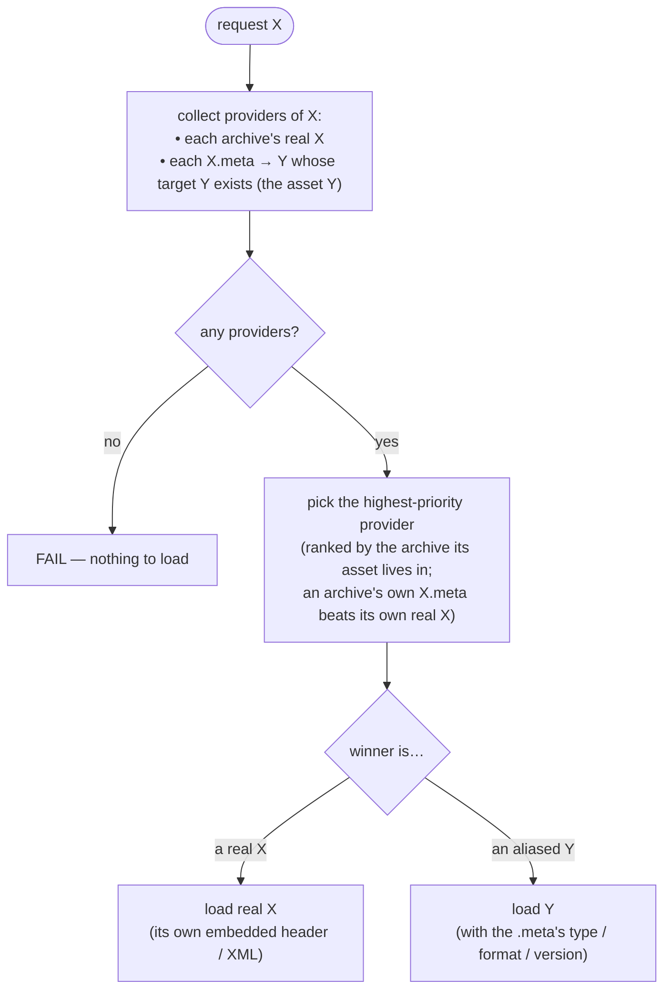

# `.meta` alias loading flow

How libultraship resolves a resource request when a `.meta` alias is involved, across one or more
layered archives. Kept as a standalone Mermaid diagram so it can be ported into the LUS doxygen
docs later. See [README.md](README.md) for the runnable test cases built from this model.

## The rule

`X.meta → Y` adds **Y as an alternate provider of X**. A request for `X` resolves to the
**highest-priority provider**, where each provider is ranked by the archive its **asset** lives in:

- **real `X`** — one provider per archive that ships a real `X`, ranked at that archive.
- **aliased `Y`** — for each `X.meta → Y` whose target `Y` exists, a provider ranked at the archive
  that ships **`Y`** (*not* the archive that ships the `.meta`).

Highest-priority provider wins. If an archive ships both a real `X` and an `X.meta`, its `.meta`
takes precedence over its own real `X`. No providers → the load fails.

"Fall back to the real asset" is **not** a separate rule — it's just the case where the alias's
target `Y` doesn't exist, so there's no aliased provider and a real `X` is what remains.

## Terms

- **X** — the requested path (e.g. `gLinkHumanSkel`).
- **X.meta** — a JSON sidecar: a target `path` (call it `Y`) plus `type` / `format` / `version`.
- **provider** — a concrete way to satisfy `X`: a real `X`, or an aliased `Y`.
- **priority** — archive load order; last loaded = highest. A provider's priority is the archive
  where its **asset** lives.

## Flow

## Worked examples — the cross-game skeleton case

Archive priority, low → high: `2ship.o2r` < `mm.o2r` < `mod.o2r`. `2ship.o2r` ships only the
`.meta`; the real `gLinkHumanSkel` lives in `mm.o2r`. Request: `gLinkHumanSkel`.

| scenario | real `gLinkHumanSkel` | aliased `gLinkChildSkel` | highest wins → loads |
|---|---|---|---|
| **A** — mod present | `mm.o2r` (middle) | `mod.o2r` (**highest**) | **`gLinkChildSkel`** (the mod's) |
| **B** — no mod | `mm.o2r` (middle) | — (`gLinkChildSkel` absent) | **`gLinkHumanSkel`** (vanilla) |
| **L1** — real in the top archive¹ | `mod2.o2r` (**highest**) | `mod1.o2r` (lower) | **`gLinkHumanSkel`** (mod2's) |

¹ L1: `mod1.o2r` has `gLinkHumanSkel.meta → gLinkChildSkel` (and a `gLinkChildSkel`); `mod2.o2r`
has a real `gLinkHumanSkel` and is loaded after `mod1`, so it's higher priority.

The whole trick: the alias's provider is ranked by where **`Y`** lives (`mod.o2r` in A,
`mod1.o2r` in L1) — **not** where the `.meta` lives. That single fact makes A resolve to the alias
and L1 to the real, with no "alias always wins" / "real always wins" special-casing.

## Notes

- The target `Y` is resolved like any normal resource, so it can sit in an archive **above or
  below** the `.meta` ("reach back").
- If `Y` is itself aliased (`Y.meta`), the same rule applies to it — resolution is recursive.
